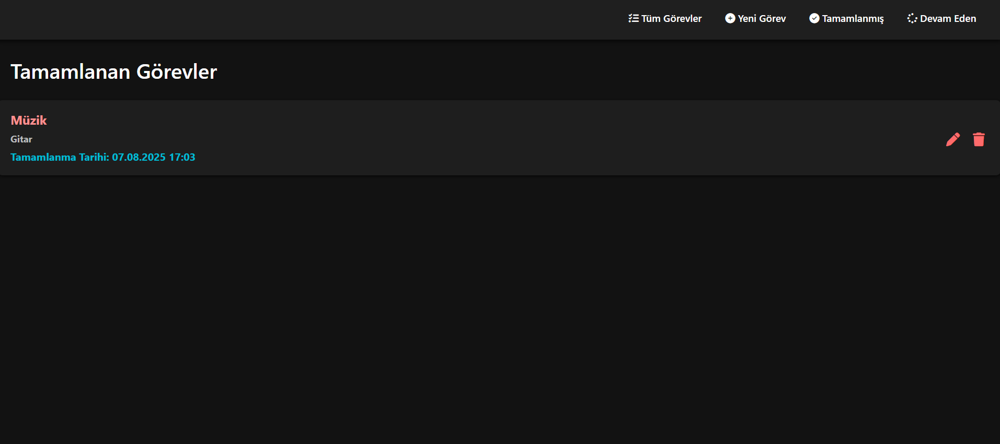
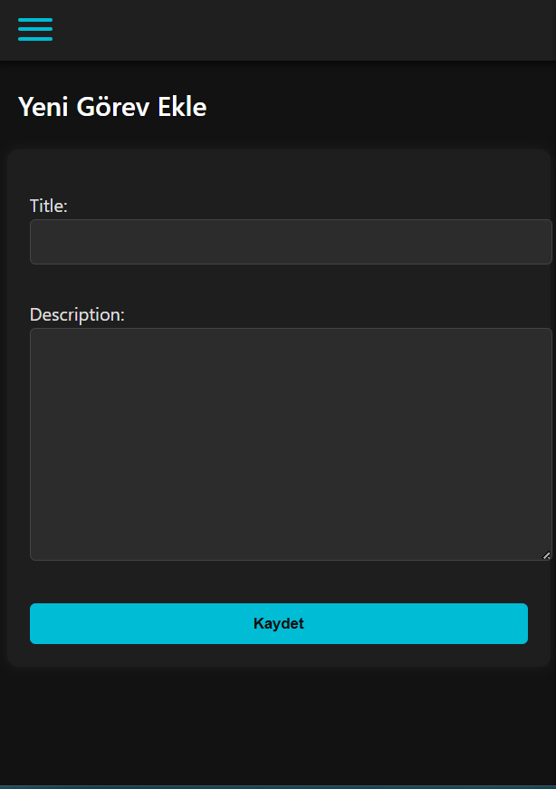
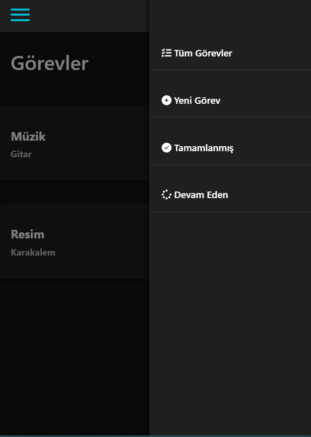

# 📝 Django Task Tracker

Bu proje, Django kullanılarak geliştirilmiş basit bir görev takip uygulamasıdır. Kullanıcılar görev ekleyebilir, silebilir, güncelleyebilir ve görev durumlarını yönetebilir.

## 🚀 Özellikler

- Görev oluşturma, silme ve düzenleme
- Görev durumu takibi (Bekliyor, Devam Ediyor, Tamamlandı)
- Kullanıcı dostu arayüz
- Admin panel üzerinden yönetim
- Basit ve hızlı kurulum

---

## 📷 Ekran Görüntüsü
### Bilgisayar Ekranı ###


### Görev Ekleme ###


### Menu ###


---
## 🛠️ Teknolojiler

- Python 3.x
- Django 4.x
- SQLite (varsayılan veritabanı)
- HTML, CSS (şablonlar)

## ⚙️ Kurulum

Projeyi çalıştırmak için aşağıdaki adımları takip edebilirsin:

### 1. Depoyu Klonla

```bash
git clone https://github.com/NazliUnay/Django-Task-Tracker.git
cd Django-Task-Tracker
```

### 2. Sanal Ortam Oluştur ve Aktifleştir

```bash
python -m venv env
# Windows:
env\Scripts\activate
# Mac/Linux:
source env/bin/activate
```

### 3. Gerekli Paketleri Yükle

```bash
pip install -r requirements.txt
```

### 4. Veritabanını Başlat

```bash
python manage.py migrate
```

### 5. Süper Kullanıcı Oluştur

```bash
python manage.py createsuperuser
```

### 6. Sunucuyu Başlat

```bash
python manage.py runserver
```

Tarayıcında şu adresi aç: [http://127.0.0.1:8000](http://127.0.0.1:8000)  
Admin paneli için: [http://127.0.0.1:8000/admin](http://127.0.0.1:8000/admin)

---

## 👩‍💻 Geliştirici Bilgileri

- **Ad Soyad**: Şerife Nazlı Ünay  
- **Üniversite**: Necmettin Erbakan Üniversitesi  
- **Bölüm**: Bilgisayar Mühendisliği  
- **LinkedIn**: [linkedin.com/in/serife-nazli-unay](https://www.linkedin.com/in/serife-nazli-unay/)  
- **Medium**: [medium.com/@nazli_unay](https://medium.com/@nazli_unay)

---
## ✉️ İletişim

Herhangi bir geri bildirim ya da geliştirme önerisi için iletişime geçebilirsiniz.  
📧 E-posta: [unay.nazli42@gmail.com](mailto:unay.nazli42@gmail.com)
